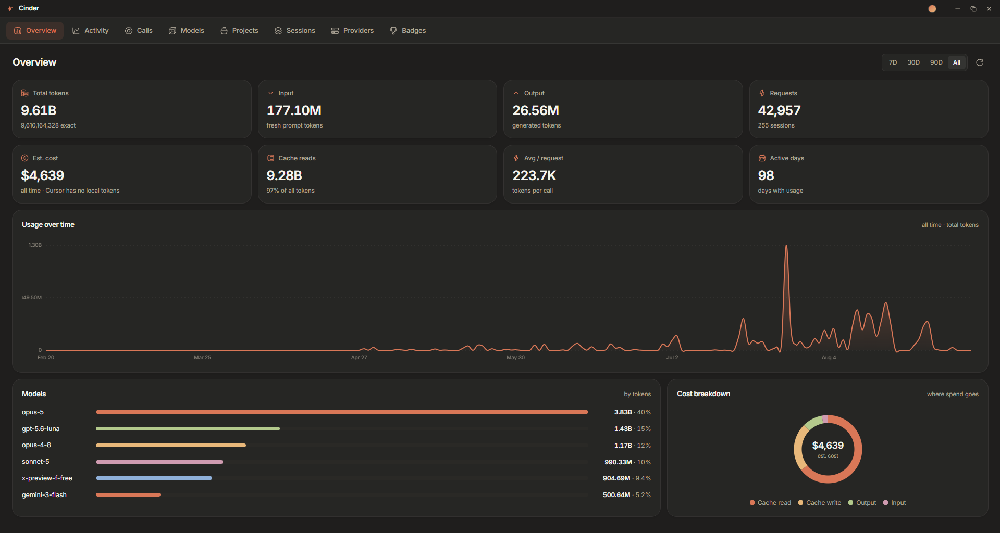
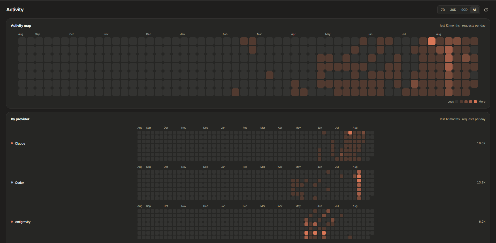
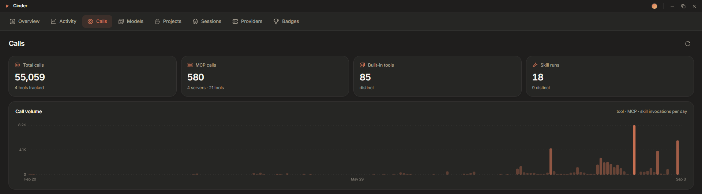
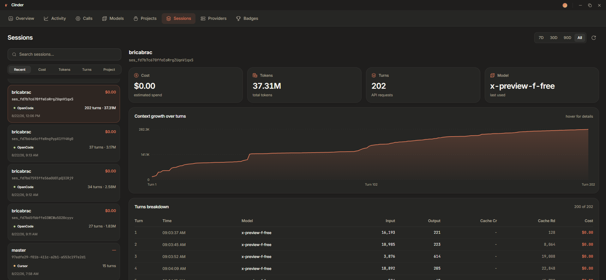

# Cinder

local desktop dashboard for AI coding token usage. reads local logs only, nothing leaves the machine. MIT.

## Install
Windows and macOS builds are on [releases](https://github.com/mydd7/cinder/releases). macOS is unsigned: right-click the app → Open.

## Setup
1. `npm install`
2. `npm start`

## Dev
`npm run dev` runs the Vite dev server and Electron with devtools.

## Build
1. `npm run build:web` — renderer to `dist/`
2. `npm run dist` — unpacked app
3. `npm run build` — installer for the current OS
4. `npm run icons` — regenerates `icon/` from `tools/make-icons.js`

## Stack
Electron, React 19, Vite, Tailwind v4, hugeicons. renderer in `src/`, collectors in `main/`, bridge in `preload.js`.

## Sources
Claude, Codex, OpenCode, Kilo, Goose, Hermes, Gemini, Qwen, Droid, Amp, Kimi, Codebuff, OpenClaw, Pi, GitHub Copilot, Cursor, Antigravity. each reader lives in `main/sources/` and resolves its own default paths plus an override env var. SQLite sources use `node:sqlite`. Antigravity stores usage as protobuf with no `.proto`, so the reader decodes by field number. Cursor does not persist token counts locally: requests, models, sessions and tool calls only.

## Pricing
per-model cost from a bundled `pricing-data.json`. unknown models are zero. no network at runtime.

`npm run pricing` rebuilds the snapshot from LiteLLM and models.dev. LiteLLM wins conflicts.

## Calls
tool, MCP and skill counts from local logs (Claude, Codex, OpenCode, Cursor). deduped by call id, cached in `calls-cache.json`.

## Scan
completed scans go to `scan-snapshot.json` in the app data dir. on launch, open the last scan or run a new one. large log sets are streamed; usage is compacted per minute per session/model.

## Shortcuts
`Ctrl/Cmd+R` rescan, `Ctrl/Cmd+1..8` switch view. theme, mode, period and window geometry persist.
